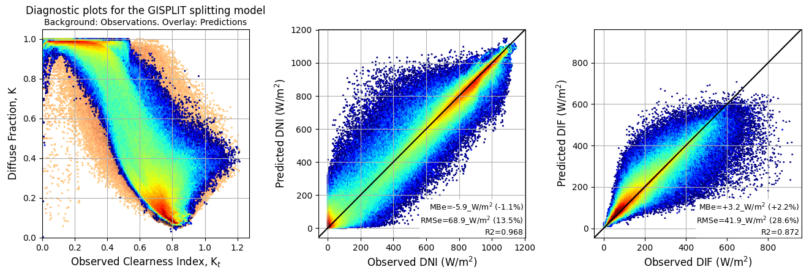

# GISPLIT: Component-separation model for 1-min GHI data

<p align="center">
<figure>
    
    <figcaption style="color:gray;font-size:90%" align="center">Separation performed for 5 sites of the <a href="https://bsrn.awi.de">BSRN</a> (MNM, tropical; ASP, dry; CAR, temperate; BON, continental; SON, polar) with 1 year of data per site, totalling &asymp;1 Mill. samples.</figcaption>
</figure>
</p>

A Python implementation of the GISPLIT global solar irradiance component-separation model for 1-min data, described in:

>Ruiz-Arias, J.A. and Gueymard, C.A. (2024) GISPLIT: High-performance global solar irradiance component-separation model dynamically constrained by 1-min sky conditions. _Solar Energy_ Vol. 269, 112363. doi: [10.1016/j.solener.2024.112363](https://doi.org/10.1016/j.solener.2024.112363) (open access)

GISPLIT relies on the [CAELUS](https://github.com/jararias/caelus) sky-condition classification algorithm for 1-min GHI data to first separate the GHI input data into different sky situations and then apply specialized separation sub-models to each sky class. During the model's development, different versions were developed for each [Koeppen-Geiger primary climate](https://en.wikipedia.org/wiki/K%C3%B6ppen_climate_classification), for all climates combined, and using, or not, [extreme gradient boosting](https://xgboost.readthedocs.io/en/stable/) for the most challenging sky situations, namely, scattered clouds and cloud enhancement events. Find further details in the GISPLIT's paper.

### Installation

```sh
python3 -m pip install git+https://github.com/jararias/gisplit@main
```

### Tests

To test it and benchmark it against same-class state-of-the-art separation models, install the [splitting_models](https://github.com/jararias/splitting_models) package:

```sh
python3 -m pip install git+https://github.com/jararias/splitting_models@main
```

and run the tests as:

```sh
python3 -c "import splitting_models.tests as sm_tests; sm_tests.basic_test()"
```

from the command-line interface or rather as:

```python
import pylab as pl
import splitting_models.tests as sm_tests
sm_tests.basic_test()
pl.show()
```

from a python script.

## Usage notes

#### Instance creation

The first step is to create a GISPLIT instance:

```python
from gisplit import GISPLIT
gs = GISPLIT(engine="reg", climate=None)
```

It accepts two input arguments:

- `engine`, which can be set to `'reg'` to use plain (conventional) regression models to separate the components in all sky situations, or `'xgb'` to use extreme gradient boosting models for scattered clouds and cloud enhancement events. Defaults to `'xgb'`.
- `climate`, to select a model version trained especifically for one of the primary Koeppen-Geiger climates (namely, `'A'`, `'B'`, `'C'`, `'D'` or `'E'`; [:mag:](https://en.wikipedia.org/wiki/K%C3%B6ppen_climate_classification)), or set to `None` to use the _all-climates_ version (default option).

> [!TIP]
> The benefits of using a climate-specific model versions are not clear (see the paper above). I recommend to use the _all-climates_ version (i.e., `climate=None`). In any case, use a climate-wise version only if you know the Koeppen-Geiger primary climate of your targetted location.

#### GHI separation and required input data

Once the GISPLIT instance is created, the separation is as follows:

```python
pred = gs.predict(data)
```

where `data` is a Pandas [DataFrame](https://pandas.pydata.org/docs/reference/api/pandas.DataFrame.html) with the following mandatory 1-min time series variables (columns):

- `sza`: the solar zenith angle, in degrees
- `eth`: the extraterrestrial solar irradiance, in W/m$`^2`$
- `ghi`: the global horizontal irradiance, in W/m$`^2`$
- `ghics`: the clear-sky global horizontal irradiacne, in W/m$`^2`$
- `difcs`: the clear-sky diffuse irradiance, in W/m$`^2`$

and, in addition, it requires:

- `longitude`: the site's longitude, in degrees
- `ghicda`: the cloudless-and-clean-and-dry-sky global horizontal irradiance, in W/m$`^2`$

to evaluate the sky type from CAELUS. However, if the sky type is known (e.g., because it has been previously evaluated with CAELUS), `longitude` and `ghicda` won't be necessary if the sky type is passed to `predict` using the `sky_type_or_func` input argument.

For instance, if the sky type is available in the `sky_type` column of `data`, you could do:

```python
pred = gs.predict(data, sky_type_or_func=data.sky_type.values)
```

or, you could do:

```python
pred = gs.predict(data, sky_type_or_func=lambda df: df.sky_type.values)
```

> [!TIP]
> If the sky type has been pre-computed, use it in `predict` because this accelerates the separation and eliminates the requirement of `longitude` and `ghicda`.

> [!TIP]
> If you are sure that the sky type is aligned with the rest of values in `data`, use the `.values` attribute of `sky_type` to prevent dataframe index alignment issues that can be raised eventually.

The `sky_type_or_func` argument accepts a Pandas Series or numpy 1-d array of CAELUS sky types with the same length as `data`, or a function that returns the sky type and receives `data` as input. 

> [!IMPORTANT]
> The DataFrame should be full, that is, without time gaps. This is so because, during the prediction, GISPLIT
uses moving windows to calculate variability indices that assume that the time series in the DataFrame are continuous

##### Notes on the input dataframe's index

The dataframe `data` index must be:

- a Pandas [DatetimeIndex](https://pandas.pydata.org/docs/reference/api/pandas.DatetimeIndex.html) in coordinated universal time (UTC), or

- a Pandas [MultiIndex](https://pandas.pydata.org/docs/reference/api/pandas.MultiIndex.html) with two levels: `times_utc` and `site`.

The multi-index option is devised to run the separation for several sites at once. The `times_utc` level is the same DatetimeIndex, in UTC, as in the "single-index" option, while `site` is a site's identifier. Internally, GISPLIT _groups_ the input dataset _by_ site (using the _groupby_ Pandas' method), performs the separation site by site, and then combines the results.

> [!TIP]
> When the sky type is pre-computed in "multi-index" datasets, the `sky_type_or_func=lambda df: df.sky_type.values` is useful to skip the re-evaluation of sky type and the need of `longitude` and `ghicda`.

#### Output of the separation

The output of `predict` is a dataframe with exactly the same index as the input dataframe and the following columns:

- `dif`: the diffuse irradiance, in W/m$`^2`$
- `dir`: the direct horizontal irradiance, in W/m$`^2`$
- `dni`: the direct normal irradiance, in W/m$`^2`$
